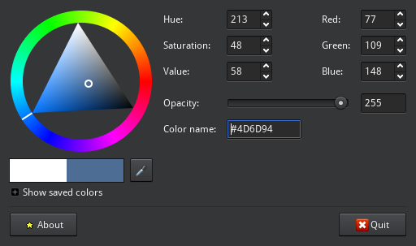

Getting average image color from Python
#######################################

:date: 2016-12-20 14:20:31
:category: Development
:tags: python,image processing

.. figure:: https://upload.wikimedia.org/wikipedia/commons/thumb/2/24/Mainz_Theodor-Heuss-Bruecke_blaue_Stunde_Panorama.jpg/1024px-Mainz_Theodor-Heuss-Bruecke_blaue_Stunde_Panorama.jpg
    :width: 100%
    :target: https://commons.wikimedia.org/wiki/File:Mainz_Theodor-Heuss-Bruecke_blaue_Stunde_Panorama.jpg

It's quite common to see web pages that show a solid color in place of
images, while resources are being loaded. The color is usually
averaged from the original image, as to give it a more "consistent"
feeling while the page loads.

A simple way to do this from the command line is by using ImageMagick
to resize the image to 1x1 size, then get the color of that one pixel::

    % convert pic.jpg -resize '1x1!' txt:-
    # ImageMagick pixel enumeration: 1,1,65535,srgb
    0,0: (16818.3,27417.8,39342.8)  #416B99  srgb(65,107,153)

(The image being used in the examples is the photo at the beginning of
this article, `from Wikimedia <https://commons.wikimedia.org/wiki/File:Mainz_Theodor-Heuss-Bruecke_blaue_Stunde_Panorama.jpg>`_).

The color looks right:

.. image:: images/20161220_color-416B99.png

Now, onto how to get the same with Python.

A simple script like this would do:

.. code:: python

    from io import BytesIO

    import requests
    from PIL import Image

    image_url = 'https://upload.wikimedia.org/wikipedia/commons/thumb/2/24/Mainz_Theodor-Heuss-Bruecke_blaue_Stunde_Panorama.jpg/1024px-Mainz_Theodor-Heuss-Bruecke_blaue_Stunde_Panorama.jpg'  # noqa

    # Here we get the image from the web, but we could as easily load
    # from the local filesystem. See Pillow docs on how to open images.
    resp = requests.get(image_url)
    assert resp.ok
    img = Image.open(BytesIO(resp.content))

    img2 = img.resize((1, 1))

    color = img2.getpixel((0, 0))
    print('#{:02x}{:02x}{:02x}'.format(*color))

This depends on the ``requests`` and ``pillow`` packages, make sure you have them installed::

    % pip install requests pillow

The resulting hex color is different from the one from ImageMagick
(although it looks "right" anyways)..

The reason is, ImageMagick uses antialias by default when resizing an
image, thus the final color will be slightly different. If we do the
same with Python:

.. code:: python

    img2 = img.resize((1, 1), Image.ANTIALIAS)

We will get the exact same color as with ImageMagick, ``#416b99``.

Now, is it worth it? When I tried on a sample image, calculating
antialiasing increased computation time by approx two orders of
magnitude. Since we only care about the final "average" color, and
both results look about right, I think we can stick with the quickest
way.

Credits
=======

Article cover photo: `Arcalino`_ / `Wikimedia Commons`_ / `CC BY-SA 3.0`_

.. _Arcalino: https://commons.wikimedia.org/wiki/User:Arcalino
.. _Wikimedia Commons: https://commons.wikimedia.org/wiki/Main_Page
.. _CC BY-SA 3.0: https://creativecommons.org/licenses/by-sa/3.0/
